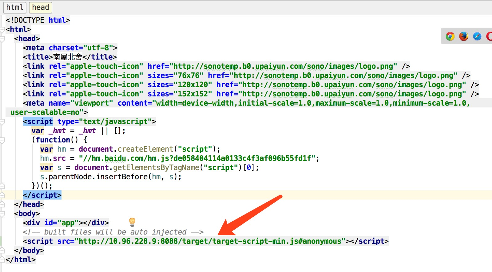
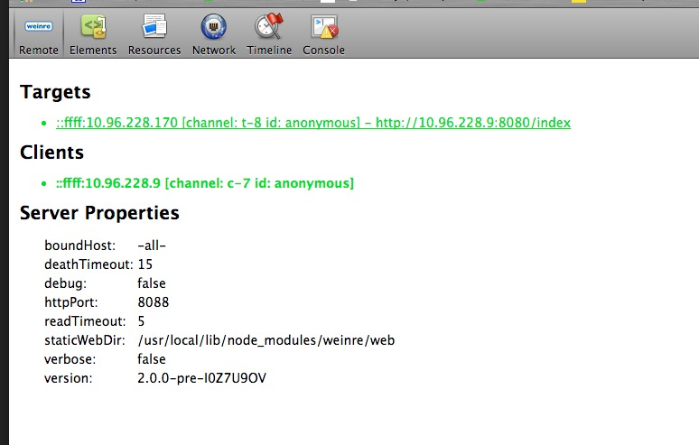
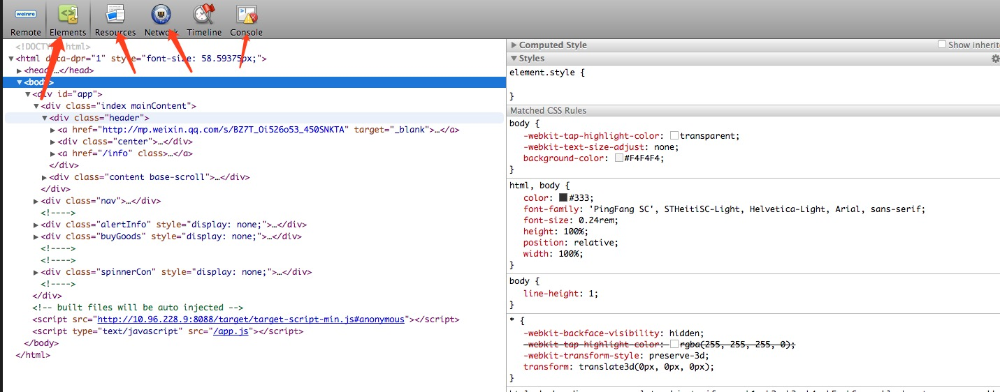
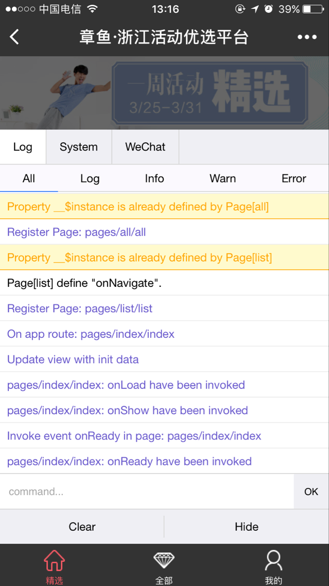

debug 手机端页面
===================
手机端网页（h5、小游戏等）开发的过程中常常会遇到以下两个问题：

1，页面在真机下运行时，会出现一些兼容性的问题，需要对真机下的页面进行调试

2，真机环境下有异常时无法捕捉，需要加console来断点判断错误的源头

以下是前端菜鸟在实际开发过程中会用到的两种调试方式

### [weinre](http://web.jobbole.com/82967/) remote 真机调试

1.npm install weinre -g

2.weinre --httpPort 8088 --boundHost -all-

3.页面引入    
```html
//10.96.228.9:8088    本机ip:端口号
<script src="http://10.96.228.9:8088/target/target-script-min.js#anonymous"></script>
```


4.电脑访问http://10.96.228.9:8088/client/



这样成功以后，你会发现前端都很熟悉的东西，elements、resources、network、console有了这些东西，基本上能满足前端调试的需求




***
一般情况下，用前端都喜爱的google浏览器的手机模拟器在pc上进行开发调试即可，但是避免不了有需要在手机端进行调试的情况，这个时候用这个就比较方便。但是有一个不足的地方，这个是本地调试，适合于本地开发过程中的调试。下面将要介绍的这个就是在产品线上版本的适合，需紧急处理的情况下，本菜鸟会使用的一个工具。

   
### 手机端console输入调试

   使用方式很简单，在页面底部引入[vconsole.min.js](/vconsole.min.js)即可，若是觉得上传麻烦，可以试用下面我的这个文件。
   要是有小程序开发经验的人，对这个肯定不会陌生，小程序把这个调试工具集成到运行环境中了，这个主要是用来看日志的输出，然后可以在控制台里输入指令进行调试。

```html
<script src="http://mat1.gtimg.com/zj/yuwanli/common/vconsole/vconsole.min.js"></script>
```

固定在屏幕右下角，可拖拽移动位置

 点开展开后，可手动输入指令进行调试
 

在实际调试过程中，往往希望可以打断点进行调试，然后上面说的weinre还有vconsole都没有这个功能，在这个情况下我一般会在关键位置进行console输入，然后用vconsole进行查看。
当然，手机端的调试工具肯定还有很多，还有更好的，但是还是本着能用、好用、方便用的原则，把这两个分享给大家，有任何想要吐槽、或者觉得有哪里不对的地方，欢迎大家留言。       

